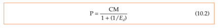
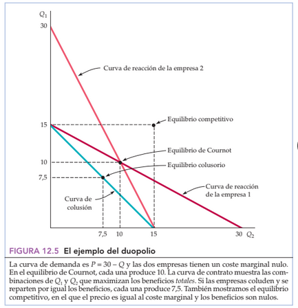

## Monopolio

- Un **Monopolista** es aquél que ofrece en el mercado un producto único (por lo cual podría decirse que él _es_ e mercado). Por ello puede modificar el precio del bien que comercializa, sin preocuparse de que otros competidores pudiesen vender un producto sustituto al suyo a un menor precio acaparando un porcentaje mayor de su mercado.
- El _ingreso medio_ del monopolista queda determinado por la curva de demanda del mercado
- El máximo beneficio que obtiene un monopolista, y será aquel punto que éste buscará alcanzar en auscencia de factores externos que no se lo permitan, es aquel en el que su _Ingreso Marginal_ iguale su _Costo Marginal_

 
- Regla práctica de fijación del precio

 
- Un mercado monopólico no tiene curva de oferta. Esto se debe a que es común que halla variaciones de precio sin variaciones de producción o viceversa porque no hay competencia
- La aplicación de un impuesto produce una elevación en el precio y una disminución de la producción. Dependiendo de la forma de la curva de demanda puede provocar un incremento incluso mayor que el valor del impuesto

 
- Dado que los monopolios puros son muy raros (en general hay unas pocas empresas que lo conforman) pero también lo es la competencia perfecta, se utiliza el **Coeficiente de Lerner** para medir el poder del monopolio

 
- En un mercado competitivo, el precio es igual al coste marginal
- El mercado monopolista provoca que se venda a un precio mayor una cantidad menor que si hubiese competencia perfecta. Esto involucra una pérdida de eficiencia. El excedente del consumidor disminuye y el del monopolista aumenta. Sin embargo, el area total disminuye

 
- Existe también la posibilidad de que la pérdida de eficiencia sea aun mayor si las empresas monopólicas incurren en gastos adicionales para arreglar acuerdos que le permitan sostener su condición de monopolio
- Regulación de precios en monopolio

 
- Un **Monopolio Natural** es aquel en el que una empresa puede producir toda la producción del mercado con menos costes que si hubiera varias empresas
- Monopolio a largo y corto plazo

 

## Oligopolio

- En el **Oligopolio** solo unas cuantas empresas producen toda o la mayor parte de toda la producción total
- El equilibrio en el Oligopolio, según **Nash**, se rige por la siguiente afirmación: _"Cada empresa obtiene el mejor resultado posible dado el resultado de sus competidoras"_
- El **Modelo de Cournot** estudia los **duopolios** y, además de concidir con Nash, sostiene que en el corto plazo se puede considerar fijo el nivel de producción de la competidora

 
- Las dos empresas **coluden** cuando buscan obtener ambas el máximo beneficio

 
- El modelo de **Stackelberg** supone que las decisiones de las dos empresas no se toman en simultaneo, sino que una se adelanta a la otra
